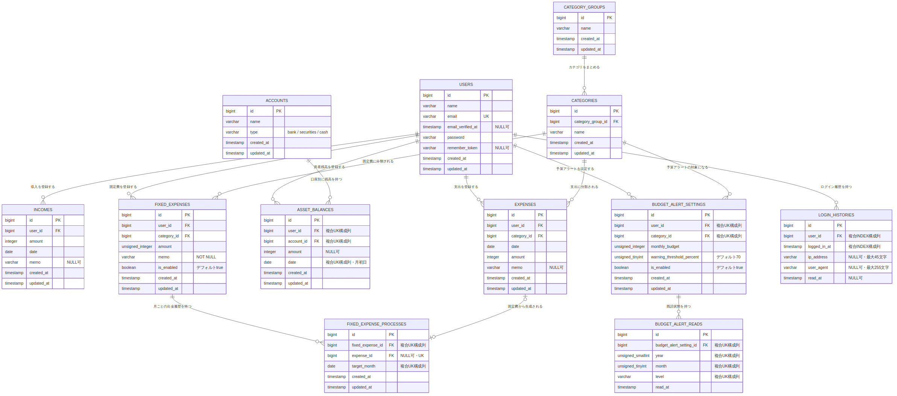

# 家計簿アプリAPI側

## 🚀 セットアップ手順

### 1. リポジトリをクローン

```bash
git clone <リポジトリURL> <フォルダ名>
cd <フォルダ名>
```

### 2. `.env` を作成

```bash
cp .env.example .env
```

#### コピーされた`.env`のデフォルトユーザー設定項目を編集

実在しないローカル確認用メールアドレス（例：`local-user@example.com`）と、
私用のパスワードとは異なるローカル専用パスワードを設定してください。

DEFAULT_USER_EMAIL=
DEFAULT_USER_PASSWORD=

## 🧰 初回セットアップ

### 3. Composer インストール（初回のみ）

ローカルに PHP を入れていない場合でも、Sail の公式 Composer イメージでインストールできます。

```bash
docker run --rm \
    -u "$(id -u):$(id -g)" \
    -v "$(pwd):/var/www/html" \
    -w /var/www/html \
    laravelsail/php83-composer:latest \
    composer install --ignore-platform-reqs
```

### 4. コンテナのビルド

```bash
./vendor/bin/sail build
```

### 5. コンテナをバックグラウンドで起動

```bash
./vendor/bin/sail up -d
```

---

## 🔧 Laravel 初期設定

### 6. アプリキー生成

```bash
./vendor/bin/sail artisan key:generate
```

### 7. マイグレーション & 初期データ投入

以下のSeederで、ローカル確認に必要な初期ユーザー、カテゴリ、口座を登録します。

- `UserSeeder`
- `CategoryGroupSeeder`
- `CategorySeeder`
- `AccountSeeder`

```bash
./vendor/bin/sail artisan migrate
./vendor/bin/sail artisan db:seed
```

エラーが発生した場合は、コンテナの起動状態、DB接続設定、マイグレーションの適用状況を確認してください。
DBを初期化するコマンドは既存データを削除するため、必要性と対象を確認せず実行しないでください。

DB確認用URL：

```
http://localhost:8080
```

---

## 各キャッシュクリアコマンド

```bash
./vendor/bin/sail artisan route:clear
./vendor/bin/sail artisan view:clear
./vendor/bin/sail artisan config:clear
./vendor/bin/sail artisan cache:clear
```

## 🔐 アクセストークンの有効期限

SanctumのBearerトークンは、発行から30日（43,200分）で無効になります。
既定値は `config/sanctum.php` に設定されており、必要な場合は環境変数で上書きできます。

```dotenv
SANCTUM_EXPIRATION=43200
```

- 有効期限は最終利用日時ではなく、トークンの発行日時を基準に判定されます
- APIへ設定を反映した時点で、発行から30日を超えた既存トークンも無効になります
- 期限切れトークンによるAPIアクセスは401を返し、再ログインが必要になります
- この設定変更にDBマイグレーションは必要ありません

## 🧪 テスト実行

テストは SQLite のインメモリデータベース上で実行されるため、開発用データベースには影響しません。

API側の全テストを実行：

```bash
./vendor/bin/sail artisan test
```

支出APIのテストケースだけを実行：

```bash
./vendor/bin/sail artisan test tests/Feature/ExpenseApiTest.php
```

入金APIのテストケースだけを実行：

```bash
./vendor/bin/sail artisan test tests/Feature/IncomeApiTest.php
```

口座・資産残高APIのテストケースだけを実行：

```bash
./vendor/bin/sail artisan test tests/Feature/AssetBalanceApiTest.php
```

認証・パスワード変更・アクセストークン有効期限のテストケースだけを実行：

- 発行から30日以内のトークンで認証済みAPIへアクセスできる
- 発行から30日を超えたトークンは401で拒否される

```bash
./vendor/bin/sail artisan test tests/Feature/AuthApiTest.php
```

ログイン履歴・既読APIのテストケースだけを実行：

- 未認証ユーザーはログイン履歴を既読にできない
- 本人のログイン履歴を既読にでき、履歴自体は保持される
- 他ユーザーのログイン履歴を既読にできない

```bash
./vendor/bin/sail artisan test tests/Feature/LoginHistoryApiTest.php
```

年次集計APIのテストケースだけを実行：

```bash
./vendor/bin/sail artisan test tests/Feature/StatsApiTest.php
```

予算アラート設定APIのテストケースだけを実行：

```bash
./vendor/bin/sail artisan test tests/Feature/BudgetAlertSettingApiTest.php
```

予算アラート判定・既読APIのテストケースだけを実行：

```bash
./vendor/bin/sail artisan test tests/Feature/BudgetAlertStatusApiTest.php
```

固定費設定APIのテストケースだけを実行：

```bash
./vendor/bin/sail artisan test tests/Feature/FixedExpenseApiTest.php
```

固定費一括出金処理のテストケースだけを実行：

```bash
./vendor/bin/sail artisan test tests/Feature/ProcessFixedExpensesTest.php
```

### マルチユーザー・口座分離の自動テスト

以下のケースをまとめて確認します。

- ログインユーザーには本人の口座だけが返される
- 所有者が設定されていない口座はDBのNOT NULL制約により登録を拒否される
- 他ユーザーの口座を指定した月次残高登録は拒否される
- 月次残高と年次集計に他ユーザーのデータが混在しない
- 非公開の対話コマンドでユーザーと専用口座を作成できる

```bash
./vendor/bin/sail artisan test \
    tests/Feature/AssetBalanceApiTest.php \
    tests/Feature/StatsApiTest.php \
    tests/Feature/ProvisionHouseholdUserCommandTest.php
```

### マルチユーザー・口座分離の手動確認

1. 未適用のマイグレーションを実行します。

```bash
./vendor/bin/sail artisan migrate
```

2. Tinkerで、既存口座が既存ユーザーに紐付いていることを確認します。

```bash
./vendor/bin/sail artisan tinker
```

```php
App\Models\User::with('accounts:id,user_id,name,type')->get(['id', 'name']);
App\Models\Account::whereNull('user_id')->count();
```

すべての既存口座の `user_id` が既存ユーザーの `id` と一致し、
未紐付け口座の件数が `0` なら正常です。

3. Tinkerを終了し、2人目のユーザーと専用口座を作成します。

```php
exit
```

```bash
./vendor/bin/sail artisan app:provision-household-user
```

名前、メールアドレス、12文字以上のパスワード、口座名、口座種別を
対話形式で入力します。実際の認証情報はREADMEやGitへ記録しないでください。

4. 既存ユーザーで以下を確認します。

- 従来の入出金、口座、月次残高が表示される
- 2人目のユーザーの口座やデータが表示されない

5. ログアウトして2人目のユーザーで以下を確認します。

- 2人目のユーザーとしてログインできる
- 作成時に登録した専用口座だけが表示される
- 入出金と月次残高が初期状態では空である
- 登録した入出金と月次残高が既存ユーザー側に表示されない

## 📦 動作環境

- Laravel Framework **13.5.0**
- PHP **8.4.8**
- Laravel Sail（Docker ベース）

---

## 📘 補足

- Sail コマンドは `./vendor/bin/sail` を `sail` エイリアスで使える前提です
- `.env` の DB 接続情報は Sail のデフォルト設定で動作します
- MySQL・Redis・Mailpit などは Sail 起動時に自動で立ち上がります

## ER図



[Mermaid形式のER図](docs/er-diagram.md)
