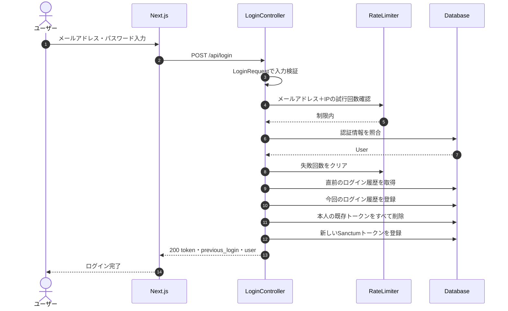
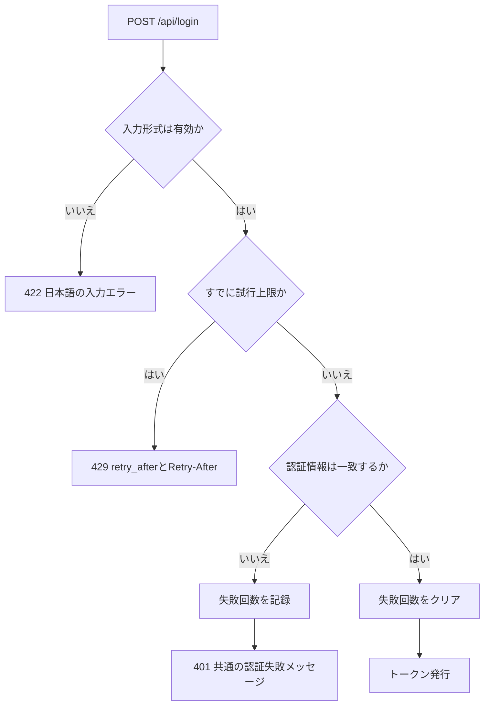
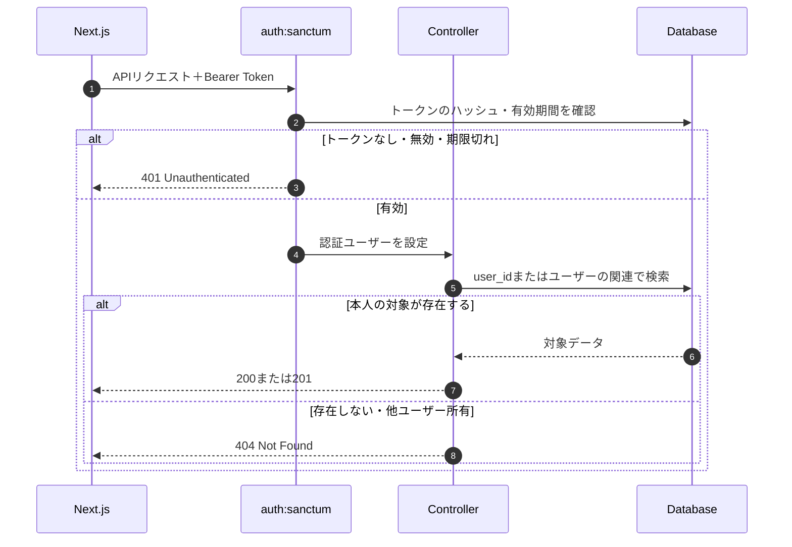
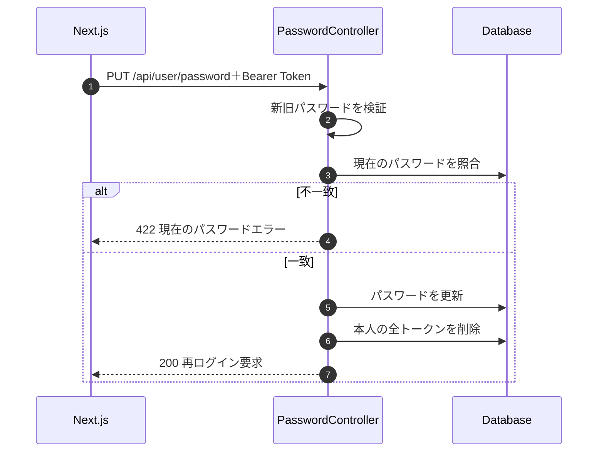

# 認証フロー

## 1. 構成

フロントエンドはLaravel Sanctumが発行するBearer Tokenを保存し、認証が必要なAPIへ`Authorization`ヘッダーで送信します。CookieベースのSPA認証ではなく、Personal Access Tokenを利用する構成です。

| 項目 | 実装 |
|---|---|
| 認証ライブラリ | Laravel Sanctum |
| トークン送信 | `Authorization: Bearer <access-token>` |
| 保護範囲 | `/api/login`以外の全API |
| 標準有効期間 | 43,200分（30日） |
| 有効期間の設定 | `SANCTUM_EXPIRATION` |
| ログイン失敗制限 | メールアドレスとIPアドレス単位で5回、60秒 |

## 2. ログイン成功

ログイン履歴にはログイン日時、IPアドレス、User-Agentを保存します。User-Agentから制御文字を除去し、255バイト以内に制限します。レスポンスの`previous_login`は今回より前の最新履歴で、初回は`null`です。

## 3. ログイン失敗と試行制限

- 試行キーは正規化したメールアドレスとIPアドレスからHMACで生成します。
- 未登録メールアドレスとパスワード不一致は同じ`401`メッセージを返します。
- 5回目の失敗を記録した後、制限期間内の次回リクエストから`429`を返します。
- 成功した場合は、そのキーの失敗回数をクリアします。
- 認証情報そのものはログへ記録しません。

## 4. 認証済みAPIリクエスト

口座を含むユーザー所有データは、`$request->user()`の関連または`user_id`条件から取得します。これにより、他ユーザーのIDを推測しても参照・更新できません。

## 5. トークンの有効期間と失効

| 操作 | 対象 | 結果 |
|---|---|---|
| ログイン | 本人の既存トークンすべて | 削除後、新しいトークンを1件発行 |
| ログアウト | 現在使用中のトークン | そのトークンだけ削除 |
| パスワード変更 | 本人の全トークン | パスワード更新と同一トランザクションで削除 |
| 有効期間超過 | 対象トークン | Sanctumが認証を拒否 |

標準の有効期間は43,200分です。実行環境で`SANCTUM_EXPIRATION`を設定した場合は、その値を使用します。

## 6. パスワード変更

新しいパスワードは8文字以上、確認入力との一致、現在のパスワードとの相違が必要です。更新後はリクエストに使用したトークンも失効します。

## 7. ログイン履歴の既読処理

ログイン成功時に返した`previous_login.id`を、`POST /api/login-histories/{id}/read`へ送信します。本人の履歴だけを更新し、履歴自体は削除しません。すでに既読の場合も同じ成功レスポンスを返すため、再送しても結果は変わりません。
