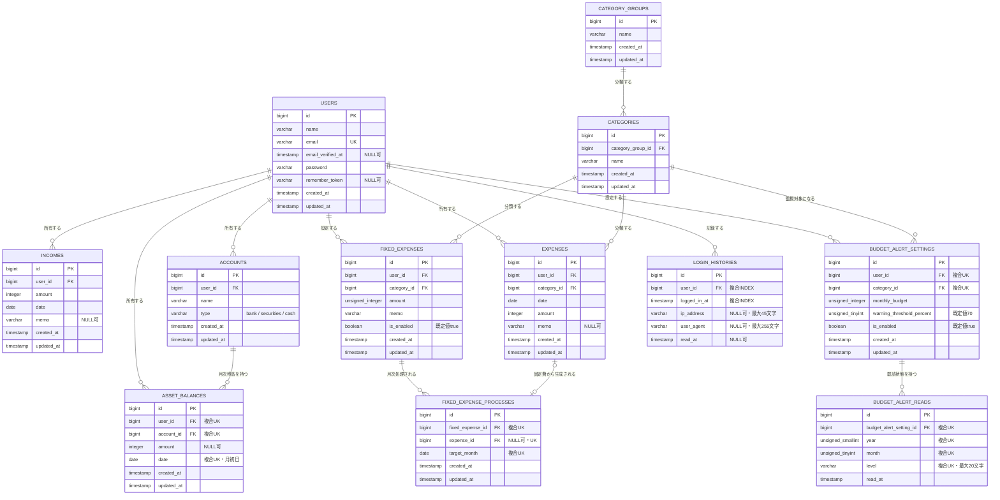
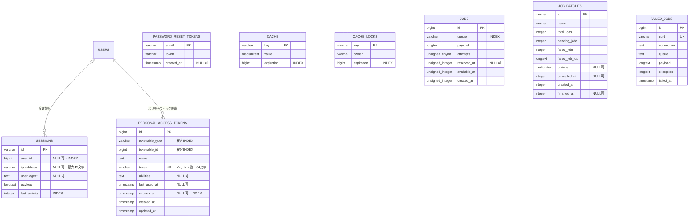

# ER図

この文書は`database/migrations`を正として、業務・認証テーブルとLaravel管理テーブルを分けて表現しています。図はGitHub上で更新内容を確認しやすいMermaid形式です。

## 1. 業務・認証テーブル

## 2. 主な制約

| テーブル | 制約 | 目的 |
|---|---|---|
| `users` | `email` UNIQUE | メールアドレスの重複防止 |
| `asset_balances` | `user_id`, `account_id`, `date` UNIQUE | 同一口座・同一月の残高を1件に限定 |
| `budget_alert_settings` | `user_id`, `category_id` UNIQUE | ユーザーごとに同一カテゴリの設定を1件に限定 |
| `budget_alert_reads` | `budget_alert_setting_id`, `year`, `month`, `level` UNIQUE | 月・警告レベル単位の既読状態を1件に限定 |
| `fixed_expense_processes` | `fixed_expense_id`, `target_month` UNIQUE | 同じ固定費の月次重複処理を防止 |
| `fixed_expense_processes` | `expense_id` UNIQUE・NULL可 | 1件の支出と複数処理履歴の紐付けを防止 |
| `login_histories` | `user_id`, `logged_in_at` INDEX | ユーザーの直近ログイン取得を補助 |

### 外部キー削除時の動作

- `users`を削除すると、関連する入金、支出、口座、資産残高、予算設定、固定費、ログイン履歴を連動して削除します。
- `category_groups`を削除するとカテゴリを、カテゴリを削除すると関連する支出、予算設定、固定費を連動して削除します。
- `accounts`を削除すると関連する資産残高を連動して削除します。
- `budget_alert_settings`を削除すると関連する既読状態を連動して削除します。
- `fixed_expenses`を削除すると関連する月次処理履歴を連動して削除します。
- 固定費から生成した`expenses`を削除した場合、処理履歴の`expense_id`だけを`NULL`にします。処理済み状態は保持されます。

### アプリケーション側の制約

- 口座、資産残高、入出金、予算設定、固定費、ログイン履歴は認証ユーザーの関連から操作します。
- `asset_balances.date`はAPIで`YYYY-MM-01`に限定します。DBカラム自体は`DATE`型です。
- `accounts.type`は`bank`、`securities`、`cash`を使用します。DBカラム自体は文字列で、列制約による値の限定はありません。

## 3. Laravel管理テーブル

`sessions.user_id`、`password_reset_tokens.email`には外部キー制約がありません。`personal_access_tokens`もポリモーフィック関連のため`users`への外部キー制約を持ちません。
