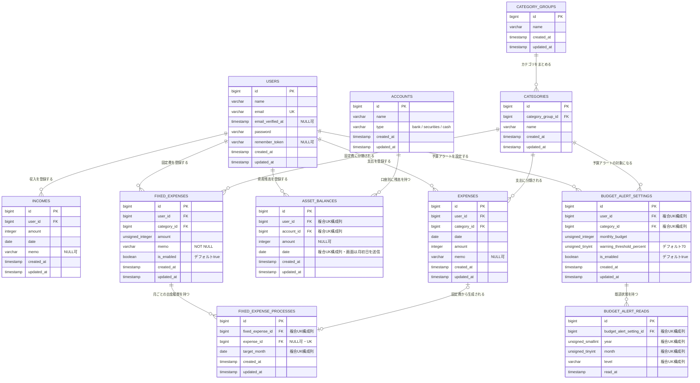
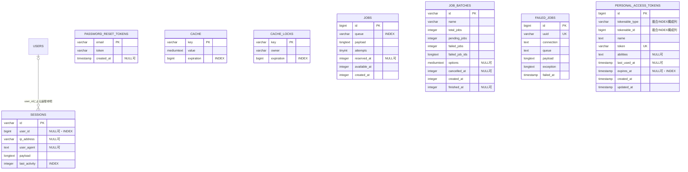

# ER図

このER図は、`database/migrations` にあるマイグレーションを基準に作成しています。業務・認証対象12テーブルとLaravelフレームワーク管理用7テーブルの合計19テーブルを掲載しています。

## 業務テーブル

### 制約

- `incomes.user_id`、`expenses.user_id`、`expenses.category_id`、`categories.category_group_id`、`asset_balances.user_id`、`asset_balances.account_id`、`budget_alert_settings.user_id`、`budget_alert_settings.category_id`、`budget_alert_reads.budget_alert_setting_id`、`fixed_expenses.user_id`、`fixed_expenses.category_id`、`fixed_expense_processes.fixed_expense_id` は、参照先の削除時に連動して削除されます。
- `asset_balances` は、`user_id`、`account_id`、`date` の組み合わせで一意です。
- `asset_balances.date` はAPIでは任意の有効日付を受理し、現行フロントエンドは対象月の月初日を送信します。
- `budget_alert_settings` は、`user_id`、`category_id` の組み合わせで一意です。
- `budget_alert_reads` は、`budget_alert_setting_id`、`year`、`month`、`level` の組み合わせで一意です。
- `fixed_expense_processes` は、`fixed_expense_id`、`target_month` の組み合わせで一意です。また、`expense_id` も一意です。
- `fixed_expense_processes.expense_id` はNULLを許可し、参照する出金が削除された場合はNULLになります。これにより、出金削除後も固定費の処理済み履歴が残ります。
- `accounts.type` の値は、マイグレーションのコメント上では `bank`、`securities`、`cash` を想定しています。DB上の列型は文字列で、値を限定する制約はありません。

## 認証・Laravelフレームワーク管理テーブル

### 補足

- `personal_access_tokens` は認証対象12テーブルに含み、残る7テーブルをLaravelフレームワーク管理用として数えます。
- `sessions.user_id` にはインデックスがありますが、マイグレーション上の外部キー制約はありません。
- `password_reset_tokens.email` と `users.email` の間にも外部キー制約はありません。
- `personal_access_tokens` は `tokenable_type` と `tokenable_id` によるポリモーフィック関連のため、特定のテーブルへの外部キー制約はありません。
